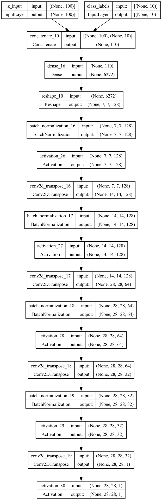
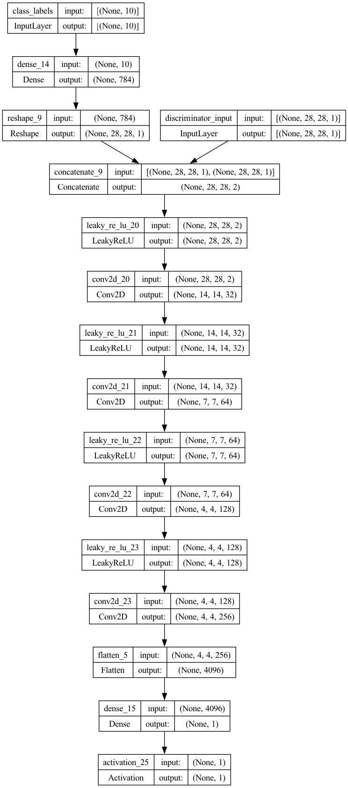
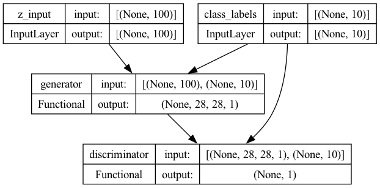

# Conditional Generative Adversarial Networks (CGAN) on MNIST

## Overview
This project implements a Conditional Generative Adversarial Network (CGAN) using the MNIST dataset, with the goal of generating handwritten digit images conditioned on their labels. The project is divided into two parts:
1. A Jupyter Notebook that demonstrates the model architecture and training process.
2. A Python script that allows users to generate images using a pre-trained model.

The model is built using Keras, and the architecture consists of a generator, a discriminator, and an adversarial model that combines both.

## Getting Started

### Prerequisites
Ensure you have the following dependencies installed:
- Python 3.x
- TensorFlow/Keras
- Matplotlib
- NumPy

You can install the dependencies with:
```bash
pip install tensorflow numpy matplotlib
```

### Directory Structure
```bash
├── architecture/
│   ├── generator_architecture.png
│   ├── discriminator_architecture.png
│   └── adversarial_architecture.png
│   └── architecture.jpg
├── cgan_mnist.py
├── cgan_mnist.h5
├── cgan_mnist.ipynb
└── README.md
```

- **architecture/**: Contains images of the model architectures (generator, discriminator, and adversarial model).
- **cgan_mnist.py**: Main Python script for training and testing the CGAN.
- **cgan_mnist.h5**: Pre-trained CGAN model.

## Project Structure

### 1. Generator

The generator takes two inputs: 
- A noise vector (`z`), which is sampled from a random uniform distribution.
- A one-hot encoded label vector representing the class of the digit to be generated.

It concatenates these inputs and transforms the combined vector into an image using several transposed convolutional layers. The final output is an image of size 28x28 pixels.

#### Generator Architecture:
- Input: Noise vector and label
- Layers: Dense, BatchNormalization, Conv2DTranspose
- Output: 28x28 grayscale image



### 2. Discriminator

The discriminator takes two inputs:
- An image (either real or generated).
- A one-hot encoded label vector.

It concatenates the image and label, then processes them through several convolutional layers to determine if the image is real or fake, conditioned on the label.

#### Discriminator Architecture:
- Input: Image and label
- Layers: Conv2D, LeakyReLU, Dense
- Output: Binary classification (real or fake)



### 3. Adversarial Model

The adversarial model combines the generator and discriminator. The generator creates an image, which is passed to the discriminator along with the label. The adversarial model is trained to fool the discriminator into classifying generated images as real.

#### Adversarial Architecture:
- Input: Noise vector and label (passed to generator)
- Layers: Generator -> Discriminator
- Output: Real or fake classification



## Training

The training process consists of two steps for each iteration:
1. **Discriminator Training**: Real images are paired with their corresponding labels, and fake images are generated by the generator. The discriminator learns to distinguish between real and fake images.
2. **Generator Training**: The generator is trained to fool the discriminator by producing images that the discriminator classifies as real.

### Training Parameters
- **Batch Size**: 64
- **Latent Vector Size**: 100
- **Training Steps**: 40,000
- **Learning Rate**: 0.0002
- **Save Interval**: 500 steps (images generated and saved)

```bash
python cgan_mnist.py
```

## Using the Pre-Trained Model

You can generate specific digits using the pre-trained model `cgan_mnist.h5` by running the following command:

```bash
python cgan_mnist.py --generator=cgan_mnist.h5 --digit=<label>
```

For example, to generate the digit 6:
```bash
python cgan_mnist.py --generator=cgan_mnist.h5 --digit=6
```

## Results

The CGAN can generate MNIST digits conditioned on their labels. As training progresses, the quality of the generated images improves, and the digits become more distinguishable.

## Conclusion

This project demonstrates how a CGAN can be applied to generate images conditioned on specific labels. By using both the generator and discriminator in tandem, the CGAN is able to create realistic images from random noise while respecting the label provided.

## Future Work
- Experiment with more complex datasets.
- Modify the architecture to handle colored images.
- Use other types of conditioning data, such as text or other metadata.


